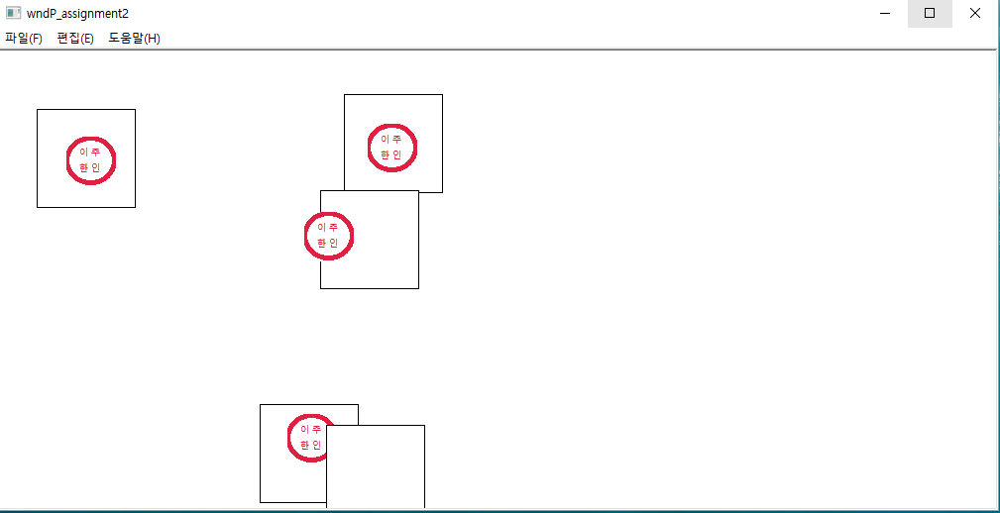
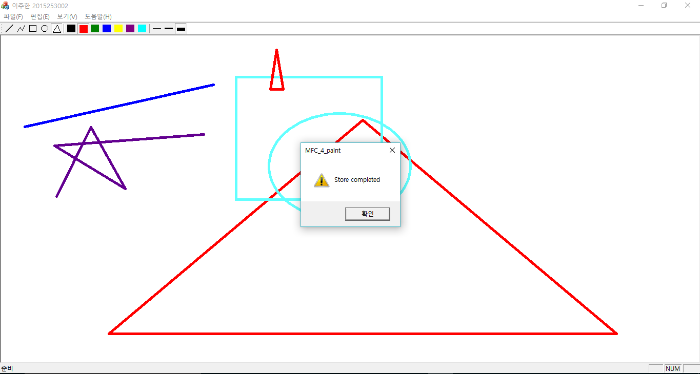
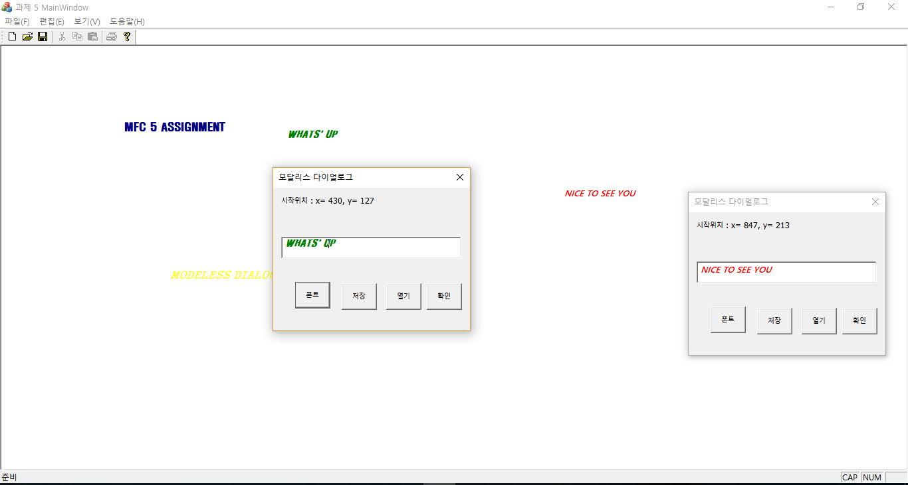
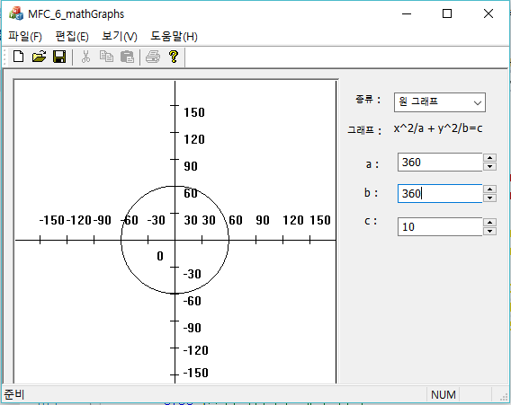

# Windows-Programming

### Yonsei University, Windows Programming(ITD3008), Prof.Hwang

### Grade: A+

### All HWs are writing MFC program with specific functions.

- [HW1](HW1/wndP_assignment1/assignment1.cpp): Open dialog and close it if input is exactly same with my name.
- [HW2](HW2/wndP_assignment2/wndP_assignment2/ChildView.cpp): Draw a rectangle at a random coordinate. Then, if there is click event, stamp my name in the rectangle. At the end, output the number of success and fails to stamp correctly.
  <!-- - -->
- [HW3](HW3/wndP_assignment_3/ChildView.cpp): While falling the balls with each grade, such as A, B, C, D, E, F, move the character ball by keyboard events and hit falling balls to get the grade balls.
- [HW4](HW4/MFC_4_paint/MFC_4_paintView.cpp): Make a paint board and draw some polygons and polylines and circles.
  <!-- - -->
- [HW5](HW5/MFC_5_Modeless/MFC_5_Modeless/MFC_5_ModelessView.cpp): Use modaless dialog to write text on the main window.
  <!-- - -->
- [HW6](HW6/MFC_6_mathGraphs/MFC_6_mathGraphs/MFC_6_mathGraphsView.cpp): Make a program which can draw some graphs.
  <!-- - -->
